# Group 7 Project
 
 # 📘 Projektiraportti  
**Projektin nimi: Pankkiautomaatti**  
**Tekijät: Valtteri Sippala, Vili Virnes, Aleksi Jussila ja Santeri Rautio**  
**2026 kevät**  

Dokumentaatio Doxygen-dokumentaatio löytyy täältä: 👉[Bank Automat ‑dokumentaatio](https://aleksijohan.github.io/bank-automat-docs/)

---

## 1. Johdanto

Tämä projekti toteuttaa pankkiautomaatin käyttöliittymän Qt:lla ja C++:lla. Sovellus kommunikoi REST‑rajapinnan kautta backendin kanssa ja mahdollistaa käyttäjälle kirjautumisen, tilitietojen tarkastelun sekä rahansiirrot.

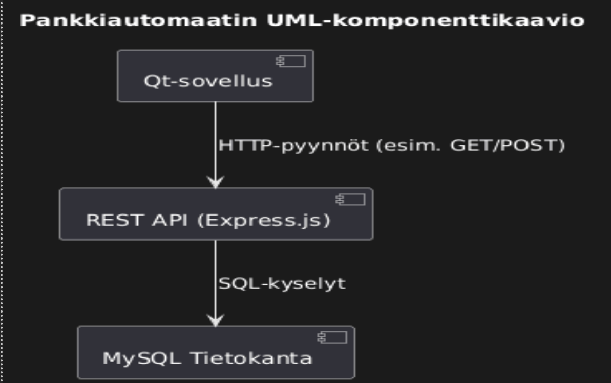

---

## 2. Projektin tavoitteet

- Toteuttaa toimiva käyttöliittymä pankkiautomaatille  
- Harjoitella Qt‑kehitystä ja C++‑ohjelmointia  
- Toteuttaa REST API ‑kutsut ja JSON‑datan käsittely  
- Rakentaa selkeä ja turvallinen kirjautumislogiikka  
- Toteuttaa nostojen, talletusten, tilisiirron ja tilitapahtumien näytöt.
- Harjoitella ryhmässä työskentelyä

---

## 3. Käytetyt teknologiat

| Teknologia | Käyttötarkoitus |
|-----------|-----------------|
| Qt        | Käyttöliittymä |
| C++       | Sovelluslogiikka |
| REST API  | Backend‑yhteydet |
| MySQL     | Tietokanta |
| JSON      | Datan siirto backendin ja frontendin välillä |
| Nginx     | Reverse proxy  |
| Docker    | Paketoi sovelluksen ja sen riippuvuudet samaan pakettin |
| Git actions CI/CD | Hoitaa sovelluksen päivitysten automaattisen käyttöönoton

---
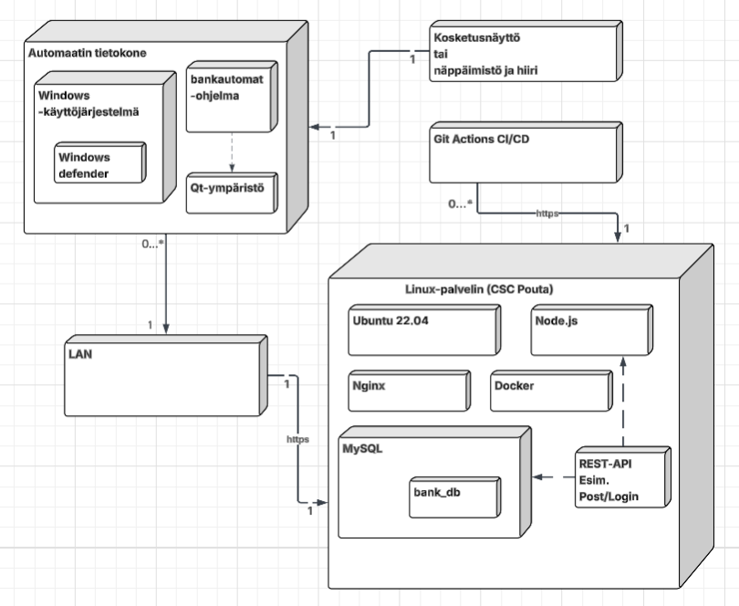

## 4. Sovelluksen arkkitehtuuri

- MainWindow hoitaa kirjautumisen
- Debit / Credit- kortilla kirjautuessa aukeaa päävalikko  
- Yhdistelmäkortilla kirjautuessa avautuu "Valitse kortti" ikkuna. Jonka jälkeen voi valita kortin.
- Accountinfo näyttää tilitiedot  
- Withdraw ja Deposit hoitavat rahansiirrot  
- Data‑ikkuna näyttää käyttäjän henkilötiedot  
- Sovelluksella voi siirtää rahaa käyttäjän tilien välillä
- Sovelluksessa voi selata tilitapahtumia

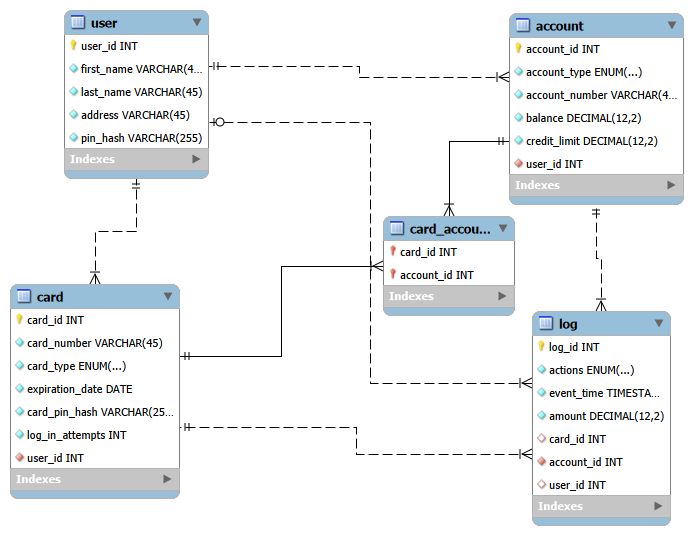

### 4.1 Api - kutsut
- Qt:ssa API‑kutsut tehdään QNetworkAccessManager‑olion avulla. 
- Ensin luodaan QNetworkRequest ja asetetaan URL sekä otsikot. 
- Lähetetään pyyntö (get, post, put, delete)
- Odotetaan vastausta signaalilla finished

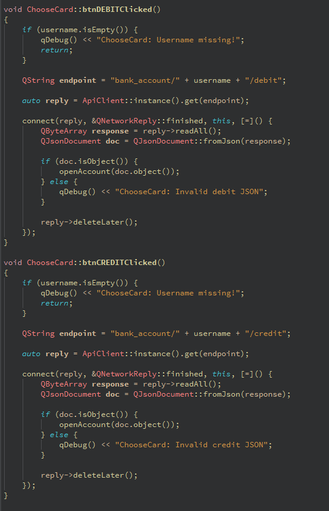

### 4.1 JSON - vastaukset
 - JSON (JavaScript Object Notation) on kevyt ja selkeä tietomuoto, jota käytetään tiedon siirtämiseen sovellusten välillä.

- JSON koostuu avain–arvo‑pareista ja muistuttaa rakenteeltaan JavaScript‑olioita.

- JSON‑vastauksia käytetään esimerkiksi API‑kutsuissa, palvelimen ja käyttöliittymän välisessä kommunikoinnissa sekä sovelluksen sisäisessä tiedonvaihdossa.

- JSON on helppolukuinen sekä ihmisille että koneille, ja se on yksi yleisimmistä tiedonsiirtostandardeista.

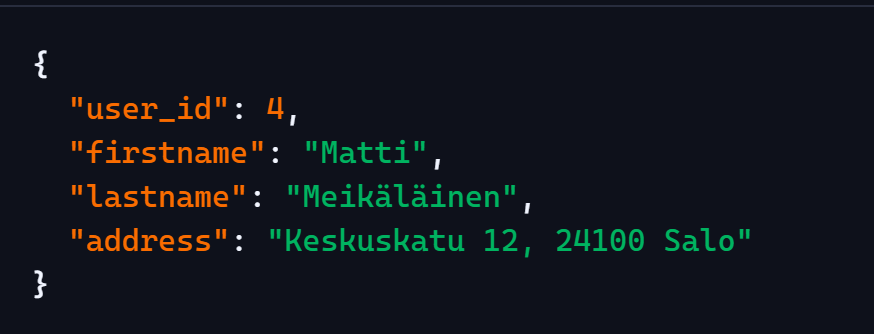

### 4.2 Ikkunoiden kommunikointi

- Sovelluksen eri ikkunat kommunikoivat keskenään signaalien, metodikutsujen tai parametrien avulla.

- Pääikkuna voi avata alavalikon tai toisen näkymän ja kuunnella sen lähettämiä signaaleja.

- Alavalikko voi lähettää takaisin signaalin, joka kertoo pääikkunalle käyttäjän toiminnasta (esim. takaisin‑painike).

- Tyypillinen kommunikointitapa on signaali, kuten: void backRequested();

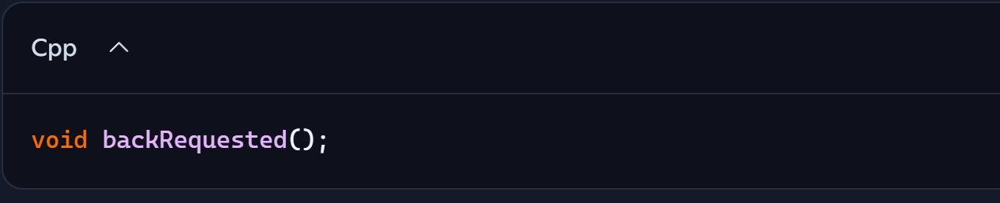
---

## 5. Toiminnallisuudet

### 5.1 Kirjautuminen
- Käyttäjä syöttää kortin numeron ja PIN‑koodin  
- Sovellus lähettää POST‑pyynnön backendille  
- Backend palauttaa tokenin ja käyttäjän tiedot  
- Virhetilanteet näytetään käyttöliittymässä 

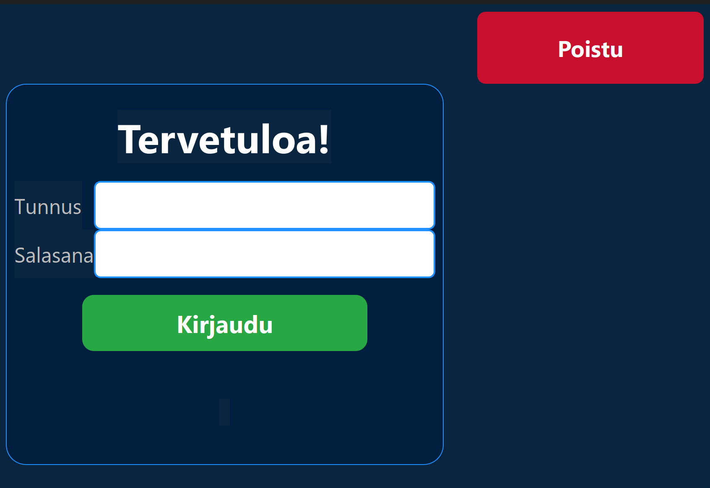

### 5.1.2
  - Käyttäjä valitsee Debit tai Credit kortin, jos hänelle on dual kortti

.png)

### 5.2 Tilitietojen näyttäminen
- Accountinfo hakee tilin tiedot automaattisesti  
- Näytetään: Tyyppi, tilinumero, saldo, luottoraja  

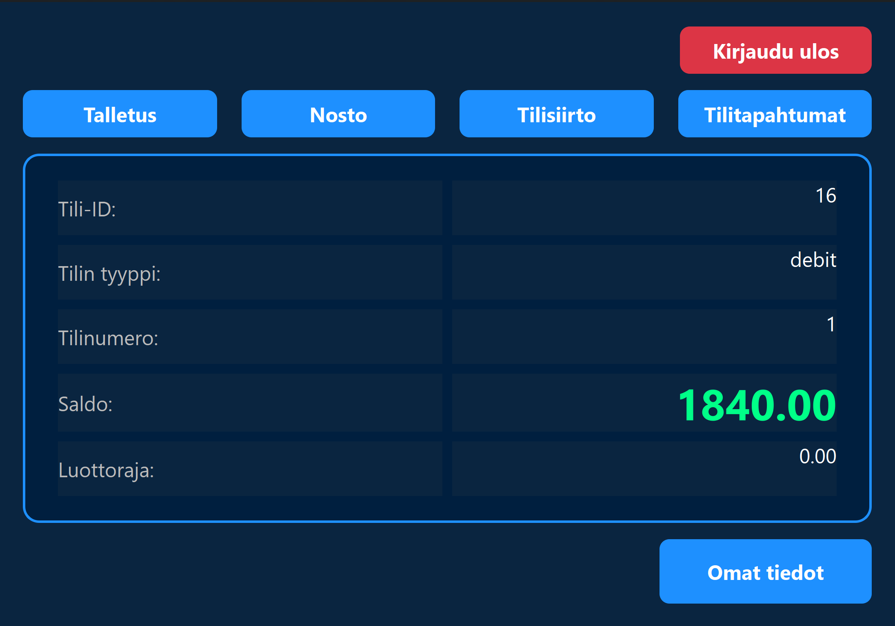

### 5.3 Nosto
- Käyttäjä valitsee summan tai syöttää sen itse  
- Sovellus tarkistaa summan kelpoisuuden  
- Backend estää debit‑tilin miinukselle menon  
- Onnistunut nosto päivittää saldon  
- Backend estää luoton ylittymisen

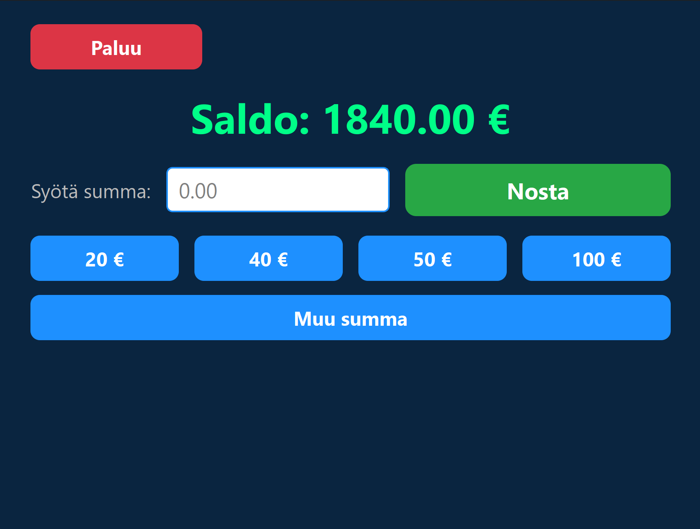

### 5.4 Talletus
- Käyttäjä syöttää talletettavan summan  
- Backend päivittää saldon  
- Accountinfo näyttää uuden saldon  

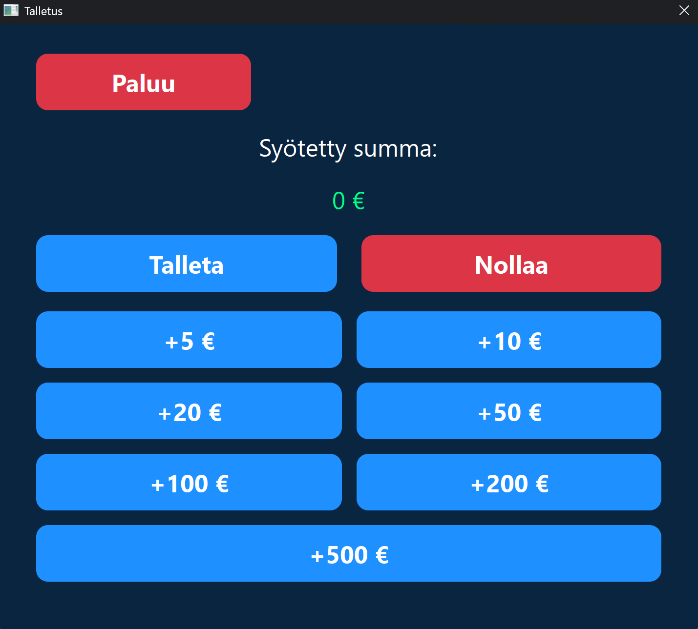

### 5.5 Rahan siirto
- Käyttäjä pystyy siirtämään rahaa tilinsä välillä.
- Backend hoitaa siirron
- Accountinfo päivittää saldon

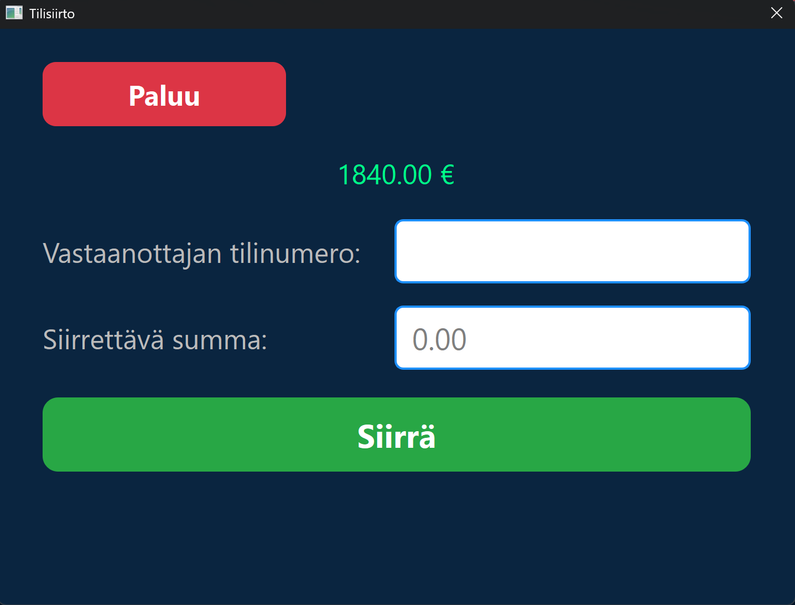

### 5.6 Henkilötiedot
- Data‑ikkuna näyttää käyttäjän nimen, osoitteen ja muut tiedot  
- Tiedot haetaan backendistä GET‑pyynnöllä  

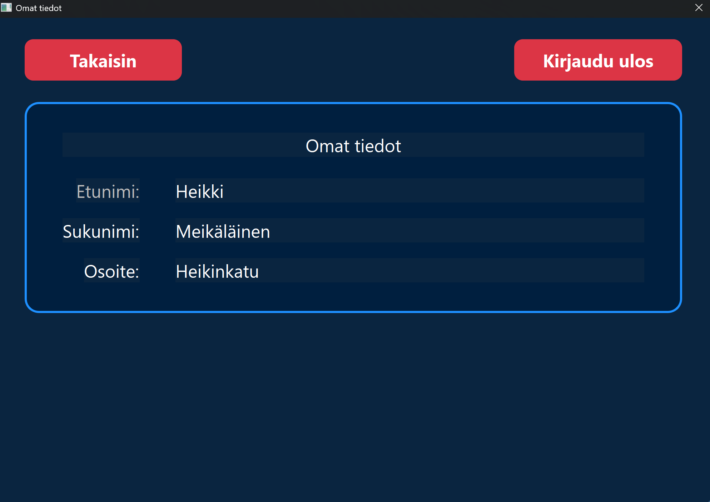

### 5.7 Tilitapahtumat
- Käyttäjä pystyy selamaan tilitapahtumia
- Tiedot haetaan backendistä log-taulusta.

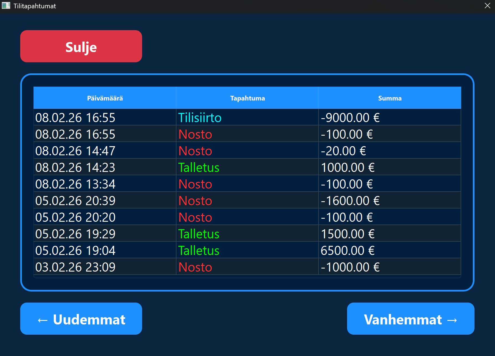

### 5.8 Kirjautumisajastin
- Ajastin aktivoituu kun kirjautumiskentissä on merkkejä.
- Jos käyttäjä ei täytä ajastimen ehtoja, niin ajastin tyhjentää kirjautumiskentät.

### 5.9 Inaktiivisuusajastin
- 30 sekunnin inaktiivisuus istunnon aikana palauttaa takaisin kirjautumis-ikkunan.
---

## 6. Käyttöliittymä

- Kirjautumisikkuna sisältää kirjautumiskentät  
- Accountinfo näyttää tilitiedot ja toiminnot  
- Nosto, talletus, siirto ja tilitapahtumat ovat erillisiä toimintoja
- Valitsekortti-ikkuna avautuu yhdistelmäkortilla  

## 7. Lisäominaisuudet
- Sovelluksen backend ja tietokanta toimii Linux-palvelimella
- Git actions CI/CD putki huolehtii sovelluksen 
- (Kuvaile lisäominaisuudet + kuva?)

## 7. Haasteita

- Aluksi oli haasteita ymmärtää kokonaiskuva projektista
- ER- Kaaviota piti korjata useita kertoja, ennekuin se tuli valmiiksi
- Tekninen määrittely oli yllättävän hankala ja työläs
- Vaikka tuli seurattua tiuhaan mitä ryhmäläiset on tehnyt, niin oli jokseenki hankala sisäistää kaikki mitä muut ovat tehneet.

## 8. Testaus

- Sovelluksen valmistusvaiheessa testausta tehtiin jatkuvasti sitä mukaa, kun uusia toiminnallisuuksia saatiin valmiiksi. Mahdolliset bugit kirjattiin kanban-tauluun, jos niitä ei heti saatu korjattua.

## 9. Johtopäätökset

- Sovellus pelaa oikealla tavalla ja olemme tyytyväisiä työhömme.

## 10. Tilakaavio

  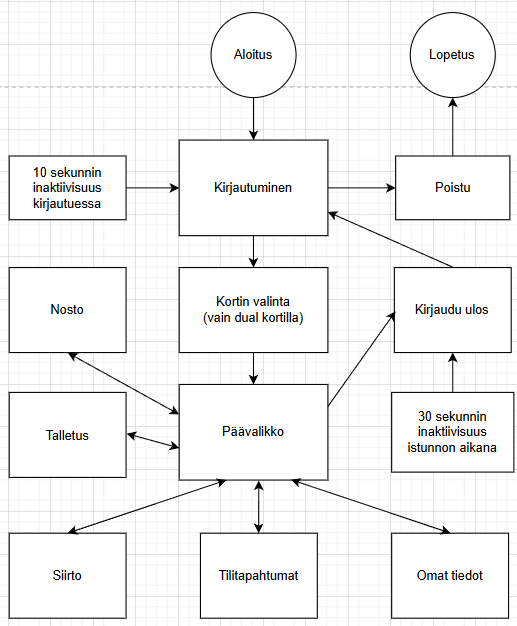

  Kirjautuminen
- Kirjautuessa 10 sekunnin inaktiivisuus alustaa kirjautumis-ikkunan

Kortin valinta (vain dual‑kortilla)
- Kortin valinnan jälkeen siirtyy päävalikkoon
- Pelkällä credit tai debit kortilla siirtyy suoraan päävalikkoon

Päävalikon toiminnot
- Nosto
- Talletus
- Siirto
- Tilitapahtumat
- Omat tiedot
- 10 sekunnin inaktiivisuus kirjautumisen aikana tyhjentää kirjautumiskentät.
- 30 sekunnin inaktiivisuus istunnon aikana palauttaa takaisin kirjautumis-ikkunan
